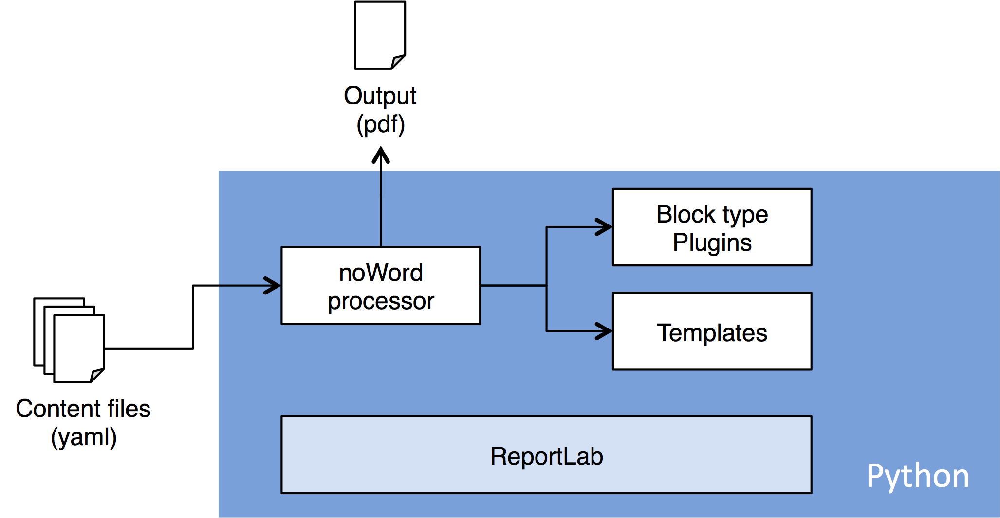

# <a name="documentMetaAuthorTemplate"></a> noWord
non-WYSIWYG document generator.
* [Introduction](#intro)
* [Input files](#input)
* [Build-in block types](#blocks)
* [Application modules](#modules)
* [Testing](#tests)
* [Developer](#dev)

## <a name="intro"></a> Introduction
The idea behind the project is to provide a very efficient text processing
framework for software developers or other IT professionals offering the following features:
  * command line user interface (no GUI) for extrem productivity
  * source files are exclusivly plain text files (git-able, pull-request, etc)
  * strict seperation between content and layout
  * foundation for complexe document generation task (not included in this project)
  * easy indexing of documents in noSql databases

The first two points make it very easy to integrate the noWord processor in any
software development environment (IDE, source code, build chain) which
makes it very convinent for software developers.

The following illustration outlines the main components of the noWord system.



Back to [Top](#top)

## <a name="input"></a> Input files

### doc_info.yaml
This files contains global settings of the document like:
* doc id, version, author, etc
* templates
* processing instructions

### Content files
As content file format we chose YAML over json for it's multiline support.
The content file is organized in blocks. Each block is a dictionary which should have
at least one entry: type. All other entries are block type specific.

```YAML
- type    : chapter
  title   : Some title

- type    : text
  content : >
    Some multiline text ...
    Another line

- type    : list
  content :
    - Item 1
    - Item 2
```

Back to [Top](#top)

## <a name="blocks"></a> Build-in block types

### <a name="block_basic"></a> Basic text elements

* [Text block](noWord/plugins/TextBlock/manual.md#manual)
* [Chapter block](noWord/plugins/ChapterBlock/manual.md#manual)
* [Title block](noWord/plugins/TitleBlock/manual.md#manual)
* [Newpage block](noWord/plugins/NewpageBlock/manual.md#manual)
* [vSpace block](noWord/plugins/VSpaceBlock/manual.md#manual)
* [List block](noWord/plugins/ListBlock/manual.md#manual)
* [Table block](noWord/plugins/TableBlock/manual.md#manual)
* [Line block](noWord/plugins/LineBlock/manual.md#manual)

### <a name="block_external"></a> External assets
* [Image block](noWord/plugins/ImageBlock/manual.md#manual)
* [PDF block](noWord/plugins/PDFBlock/manual.md#manual)

### <a name="block_structure"></a> Document structure elements
* [Tabel of Content block](noWord/plugins/TOCBlock/manual.md#manual)
* [Anchor block](noWord/plugins/AnchorBlock/manual.md#manual)
* [Decoration block](noWord/plugins/DecorationBlock/manual.md#manual)
* [StickToBottom block](noWord/plugins/StickToBottomBlock/manual.md#manual)

### <a name="block_data"></a> External data processing
* [Resource block](noWord/plugins/ResourceBlock/manual.md#manual)
* [Foreach block](noWord/plugins/ForeachBlock/manual.md#manual)
* [Value block](noWord/plugins/ValueBlock/manual.md#manual)
* [Chart block](noWord/plugins/ChartBlock/manual.md#manual)
* [Progressbar block](noWord/plugins/ProgressBarBlock/manual.md#manual)
* [TodoItem block](noWord/plugins/TodoItemBlock/manual.md#manual)

Back to [Top](#top)

## <a name="modules"></a> Application modules

### Block type Plugins
You can define your own block types using the plugin mecanism.

### Templates
For maximum flexibility, you can write you own templates using python.

## <a name="tests"></a> Testing

Back to [Top](#top)

### Functional Testing
For each plugin a functional test was implemented. The following document
describes the functional test:

[Functional Test Protocol](/doc/FTP_noWord_1.pdf)

Back to [Top](#top)

## <a name="dev"></a> Developer

### Built With / Credits

* [ReportLab](http://www.reportlab.com/opensource/) - ReportLab is the time-proven,
ultra-robust open-source engine for creating complex,
data-driven PDF documents and custom vector graphics.

* [Font Awesome](http://fontawesome.io/) - Font Awesome is a scalable vector icons library that can instantly be customized.

### Contributing

Please read [CONTRIBUTING.md](https://gist.github.com/PurpleBooth/b24679402957c63ec426) for
details on our code of conduct, and the process for submitting pull requests to us.

### Versioning

We use [SemVer](http://semver.org/) for versioning. For the versions available, see the [tags on this repository](https://github.com/symbios-orthopedics/noWord/tags).

### Authors

* **Matthias Müller** - [mmuellersk](https://github.com/mmuellersk)

### Contributers

* **Benoist Wolleb**
* **Sebastien Pasche**
* **Cyril Sester**
* **Daniel Fernandes**
* **David Zéni**
* **Cédric Monard**


## License

This project is licensed under the GPL License - see the [LICENSE](LICENSE) file for details

## Acknowledgments

* Hat tip to anyone who's code was used
* Inspiration
* etc

Back to [Top](#top)
