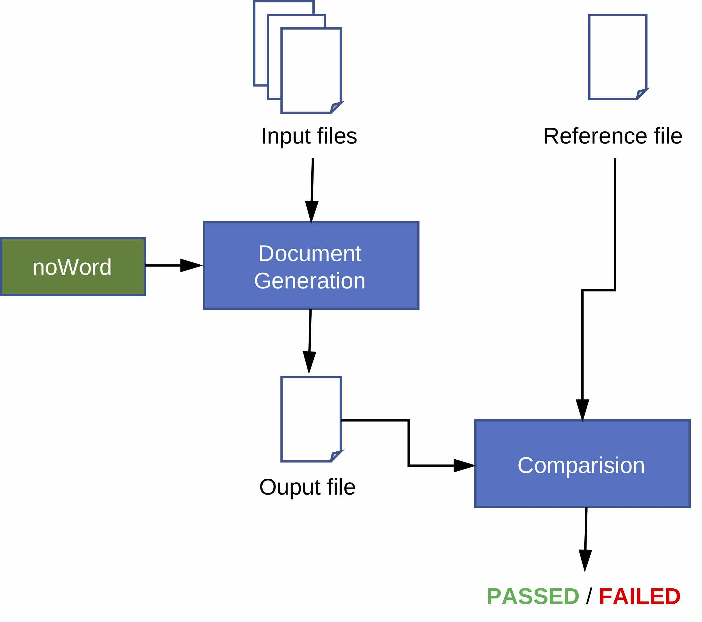

# <a name="top"></a> Functional Tests
* [Introduction](#intro)
* [Test environment](#env)
* [Test setup](#setup)
* [Test execution](#exec)
* [Acceptance criteria](#accept)

Back to [Documentation](../README.md#tests)

## <a name="intro"></a> Introduction

The main functional elements in noWord are the plugins implementing each a given text block. The objective of the function tests s to provide a functional test for each plugin covering all aspects of this given plugin. The following illustration outlines functional test procedure.



The comparison function will compare the content of the generated document and the reference document. The detailed rendering is not included in the comparison function.

Back to [Top](#top)

## <a name="env"></a> Test environment
The functional tests are executed inside the repository folder. In the following the root folder of the local git repository is referenced as RepositoryFolder.  
The following files implements the execution of all functional test:

**`tests/run_tests.py`**

The input files for each test case are stored in the following folder:

**`tests/cases`**

Back to [Top](#top)

## <a name="setup"></a> Test setup

The first step is to clone source repository:

``` shell
$> git clone https://github.com/mmuellersk/noWord.git
```

Setup virtual env:

``` shell
$> python3 -m virtualenv venv --python=python3
$> source venv/bin/activate
$> pip install requirement.txt
```

Back to [Top](#top)

## <a name="exec"></a> Test execution
Run all functional tests:

``` shell
$> python3 ./tests/run_tests.py ./tests/cases/ ./validation/03_test/data/
```

The functional test report can be generated with the following command:

``` shell
$> python3 noWord/nw_proc.py validation/03_test/functional/protocol build/03_test
```

Back to [Top](#top)

## <a name="accept"></a> Acceptance criteria

All functional test shall pass. The generated document should identical to the reference document of the corresponding test case from point of view of content. The detailed rendering of a given page might be slightly different between the output document and the reference document.

Back to [Top](#top)
